# Problem Statement & System Requirements

## 1. Problem Statement

### Business Context
Modern e-commerce businesses face a critical challenge in digital marketing: generating high-quality, engaging advertisement creatives for thousands of products manually is time-consuming, resource-intensive, and inconsistent. Marketing teams need to produce compelling ad copy for social media platforms (Instagram, Facebook, TikTok) at scale while maintaining brand voice and optimizing for engagement.

### The Challenge
- **Volume Problem**: E-commerce catalogs contain thousands to millions of products
- **Speed Problem**: Manual ad creation takes 15-30 minutes per product
- **Consistency Problem**: Quality varies across different copywriters
- **Cost Problem**: Professional copywriters cost $50-100 per hour
- **Iteration Problem**: A/B testing requires multiple versions per product

### Project Objective
Design and deploy a **Generative AI-powered Ad Creative Automation System** that:
1. Automatically generates marketing creatives (text-based ads) from product metadata
2. Follows standardized brand style suitable for social media
3. Operates at production scale with full MLOps infrastructure
4. Ensures continuous delivery, monitoring, and automated retraining

### Success Metrics
- **Latency**: Generate ads in < 5 seconds per product
- **Quality**: Achieve quality score > 0.5 (based on keyword density, length, engagement markers)
- **Throughput**: Handle 100+ requests per minute
- **Availability**: 99%+ uptime with auto-scaling
- **Cost**: Reduce ad creation cost by 80% compared to manual process

---

## 2. System Requirements

### 2.1 Functional Requirements

#### Core Features

| Feature | Requirement | Implementation |
|---------|-------------|----------------|
| **Data Ingestion** | Pull product metadata (name, category, description) from CSV/API | Airflow DAG with scheduled ingestion |
| **Generative Model** | Fine-tuned LLM for text creatives (T5, GPT-Neo, or LLaMA-based) | Gemma-2-2B-IT quantized model (Q5_K_M) |
| **Model Versioning** | Track datasets and model versions | MLflow experiment tracking + model registry |
| **Model Deployment** | Containerize inference service | Docker + FastAPI REST API |
| **Production Deployment** | Deploy on cloud Kubernetes | Azure AKS with LoadBalancer |
| **CI/CD Pipeline** | Automated testing, build, and deployment | GitHub Actions workflow |
| **Monitoring** | Track performance and inference latency | Custom Prometheus exporter |
| **Visualization** | Real-time dashboards for system health | Grafana dashboards with alerts |
| **Orchestration** | Schedule batch inference and retraining | Apache Airflow DAGs |

#### Input Specifications
```json
{
  "title": "Product name (required, string, max 100 chars)",
  "description": "Product description (optional, string, max 500 chars)"
}
```

#### Output Specifications
```json
{
  "ad_creative": "Generated ad text (string, 50-80 words)",
  "quality_score": "Estimated quality (float, 0-1)",
  "char_count": "Character count (integer)",
  "word_count": "Word count (integer)"
}
```

### 2.2 Non-Functional Requirements

#### Performance Requirements
- **API Latency**: 
  - P50 < 2 seconds
  - P95 < 5 seconds
  - P99 < 10 seconds
- **Throughput**: Minimum 100 requests/minute sustained
- **Concurrent Users**: Support 50+ simultaneous requests
- **Batch Processing**: Process 1000+ products in < 30 minutes

#### Availability & Reliability
- **Uptime**: 99%+ availability (SLA target)
- **Error Rate**: < 5% failed requests
- **Recovery Time**: Auto-restart failed pods within 30 seconds
- **Data Durability**: All training runs and metrics persisted in MLflow

#### Scalability
- **Horizontal Scaling**: Auto-scale from 2 to 10 pods based on CPU/memory
- **Storage Scaling**: Support for 100K+ product records
- **Model Scaling**: Handle model sizes up to 4GB in memory

#### Security
- **Authentication**: Docker Hub credentials via Kubernetes secrets
- **Network Security**: Internal services isolated, only API exposed externally
- **Data Privacy**: No PII stored; product metadata only

#### Monitoring & Observability
- **Metrics Collection**: Every request tracked with latency, status, quality score
- **Log Retention**: 7 days of application logs
- **Alert Response**: Critical alerts within 5 minutes
- **Dashboard Updates**: Real-time metrics (10-second refresh)

---

## 3. System Architecture

### 3.1 High-Level Architecture

```
┌─────────────────────────────────────────────────────────────┐
│                     USER LAYER                               │
│  ┌─────────────┐  ┌──────────────┐  ┌──────────────┐       │
│  │   Client    │  │    Batch      │  │   Dashboard  │       │
│  │   (API)     │  │   Airflow     │  │   (Grafana)  │       │
│  └──────┬──────┘  └──────┬───────┘  └──────┬───────┘       │
└─────────┼─────────────────┼──────────────────┼──────────────┘
          │                 │                  │
          ▼                 ▼                  ▼
┌─────────────────────────────────────────────────────────────┐
│                   APPLICATION LAYER                          │
│  ┌──────────────────────┐      ┌────────────────────┐       │
│  │   FastAPI Service    │◄─────┤   Airflow DAGs     │       │
│  │  (Ad Generation)     │      │  - Data Ingestion  │       │
│  │  + Prometheus        │      │  - Training        │       │
│  │    Exporter          │      │  - Batch Inference │       │
│  └──────────┬───────────┘      └────────────────────┘       │
└─────────────┼──────────────────────────────────────────────┘
              │
              ▼
┌─────────────────────────────────────────────────────────────┐
│                    ML/AI LAYER                               │
│  ┌──────────────┐    ┌──────────────┐   ┌───────────┐      │
│  │    LLM       │    │   MLflow     │   │  Drift    │      │
│  │  (Gemma-2B)  │    │  Tracking    │   │ Detection │      │
│  │  Inference   │    │  + Registry  │   │  Monitor  │      │
│  └──────────────┘    └──────────────┘   └───────────┘      │
└─────────────────────────────────────────────────────────────┘
              │
              ▼
┌─────────────────────────────────────────────────────────────┐
│              MONITORING & OBSERVABILITY                      │
│  ┌──────────────┐    ┌──────────────┐   ┌───────────┐      │
│  │  Prometheus  │────►   Grafana    │   │  Alerts   │      │
│  │   (Metrics)  │    │ (Dashboards) │   │  (Rules)  │      │
│  └──────────────┘    └──────────────┘   └───────────┘      │
└─────────────────────────────────────────────────────────────┘
              │
              ▼
┌─────────────────────────────────────────────────────────────┐
│                 INFRASTRUCTURE LAYER                         │
│  ┌──────────────────────────────────────────────────┐       │
│  │         Azure Kubernetes Service (AKS)            │       │
│  │  - Auto-scaling (HPA)                             │       │
│  │  - LoadBalancer                                   │       │
│  │  - ConfigMaps/Secrets                             │       │
│  └──────────────────────────────────────────────────┘       │
└─────────────────────────────────────────────────────────────┘
```

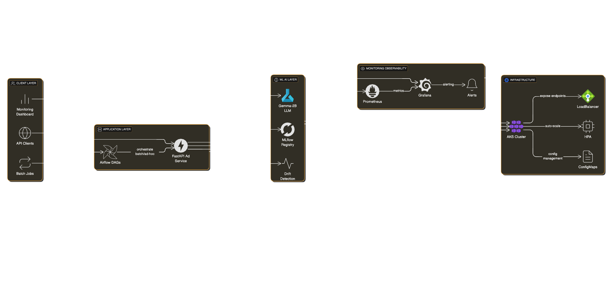


### 3.2 Data Flow

#### Training Pipeline Flow
```
Product Data (CSV) → Airflow Ingestion DAG → 
→ Azure Blob Storage → Training DAG → 
→ Fine-tuned Model → MLflow Registry → 
→ Model Versioned → Deployment
```

#### Inference Pipeline Flow
```
API Request → FastAPI Endpoint → 
→ Load Model from MLflow → LLM Inference → 
→ Quality Estimation → Drift Detection → 
→ Prometheus Metrics → Response to Client
```

#### Monitoring Pipeline Flow
```
API Requests → Prometheus Exporter → 
→ Prometheus Scraping → Grafana Visualization → 
→ Alert Rules → Notifications
```


### 3.3 Component Details

#### A. Data Layer
- **Storage**: Azure Blob Storage (production) / Local filesystem (development)
- **Format**: CSV files with columns: `title`, `description`, `category`
- **Ingestion Frequency**: Daily via Airflow scheduler
- **Data Volume**: 1000+ products initially, scalable to 100K+

#### B. Model Layer
- **Base Model**: Gemma-2-2B-IT (Google's instruction-tuned model)
- **Quantization**: Q5_K_M (5-bit quantization for efficiency)
- **Model Size**: ~1.5GB on disk
- **Context Window**: 8192 tokens
- **Inference Engine**: llama.cpp via llama-cpp-python

#### C. API Layer
- **Framework**: FastAPI (Python 3.12)
- **Endpoints**:
  - `POST /generate` - Generate ad creative
  - `POST /generate-multimodal` - Generate ad with layout (bonus)
  - `GET /metrics` - Prometheus metrics
  - `GET /health` - Health check
  - `GET /drift-report` - Model drift status
- **Concurrency**: Async/await for non-blocking I/O
- **Rate Limiting**: Kubernetes-level via HPA

#### D. Orchestration Layer
- **Tool**: Apache Airflow 2.x
- **Executor**: SequentialExecutor (development) / KubernetesExecutor (production)
- **DAGs**:
  1. `data_ingestion` - Daily product data fetch
  2. `weekly_training` - Weekly model retraining
  3. `batch_inference` - On-demand batch processing
- **Scheduling**: Cron-based with catch-up disabled

#### E. Monitoring Layer
- **Metrics Backend**: Prometheus
- **Visualization**: Grafana
- **Custom Metrics**:
  - `ad_latency_seconds` - Request latency histogram
  - `ad_quality_score` - Quality distribution
  - `ad_requests_total` - Request counter by status
  - `ad_throughput_total` - Successful generations
  - `model_quality_drift_score` - Drift detection metric
  - `ad_active_requests` - Concurrent requests gauge

#### F. Deployment Layer
- **Container Runtime**: Docker
- **Orchestration**: Kubernetes (AKS)
- **Scaling**: HorizontalPodAutoscaler (2-10 replicas)
- **Service Type**: LoadBalancer with external IP
- **Config Management**: ConfigMaps for environment variables
- **Secret Management**: Kubernetes Secrets for credentials

### 3.4 Technology Stack

| Layer | Technology | Version | Purpose |
|-------|-----------|---------|---------|
| **ML Model** | Gemma-2-2B-IT | Q5_K_M | Text generation |
| **Inference** | llama-cpp-python | 0.2.x | Fast LLM inference |
| **API Framework** | FastAPI | 0.104+ | REST API service |
| **Model Tracking** | MLflow | 2.9+ | Experiment tracking & model registry |
| **Orchestration** | Apache Airflow | 2.8+ | Workflow scheduling |
| **Monitoring** | Prometheus | 2.x | Metrics collection |
| **Visualization** | Grafana | 10.x | Dashboards & alerts |
| **Containerization** | Docker | 24.x | Application packaging |
| **Container Registry** | Docker Hub | - | Image storage |
| **Orchestration** | Kubernetes | 1.28+ | Container orchestration |
| **Cloud Provider** | Azure AKS | - | Managed Kubernetes |
| **CI/CD** | GitHub Actions | - | Automated pipeline |
| **Programming** | Python | 3.12 | Primary language |


---

## 4. MLOps Pipeline Design

### 4.1 Continuous Integration (CI)

**Trigger**: Push to `main` branch

**Steps**:
1. **Code Quality Check**
   - Linting with flake8
   - Format validation with black
   - Import validation

2. **Testing**
   - Unit tests for API endpoints
   - Integration tests for model loading
   - Kubernetes manifest validation

3. **Security Scanning**
   - Dependency vulnerability checks
   - Container image scanning

### 4.2 Continuous Delivery (CD)

**Trigger**: CI pipeline success on `main` branch

**Steps**:
1. **Build Phase**
   - Docker image build with multi-stage optimization
   - Tag with version and commit SHA
   - Push to Docker Hub

2. **Deploy Phase**
   - Create/update AKS cluster
   - Apply Kubernetes manifests
   - Update ConfigMaps and Secrets
   - Rolling update deployment

3. **Verification Phase**
   - Health check endpoint validation
   - Smoke tests on live endpoints
   - Metrics collection confirmation

### 4.3 Continuous Training (CT)

**Trigger**: Weekly schedule + manual trigger option

**Steps**:
1. **Data Preparation**
   - Fetch latest product data
   - Validate data quality
   - Version dataset in MLflow

2. **Model Training**
   - Load base model (Gemma-2B)
   - Fine-tune on new data
   - Log metrics to MLflow

3. **Model Evaluation**
   - Calculate perplexity
   - Run quality benchmarks
   - Compare with previous version

4. **Model Registration**
   - Register in MLflow Model Registry
   - Tag as "candidate" or "production"
   - Store model artifacts

### 4.4 Continuous Monitoring (CM)

**Real-time Monitoring**:
- Request latency tracking (P50, P95, P99)
- Quality score distribution
- Error rates by type
- Throughput metrics
- Active request count
- Model drift detection

**Alerting Rules**:
- High latency (P95 > 5s)
- Low quality scores (median < 0.5)
- High error rate (> 10%)
- Service unavailability
- Model drift detected


---

## 5. Deployment Strategy

### 5.1 Development Environment
- **Local Docker Compose**: All services running locally
- **Kind Cluster**: Local Kubernetes for testing
- **Port Mappings**:
  - 8000: API service
  - 8001: Metrics endpoint
  - 8080: Airflow UI
  - 5000: MLflow UI
  - 9090: Prometheus UI
  - 3001: Grafana UI

### 5.2 Production Environment (AKS)
- **Cluster Configuration**:
  - Free tier AKS
  - 1-10 nodes (auto-scaled)
  - Node size: Standard_B2s (2 vCPU, 4GB RAM)
  
- **Resource Allocation**:
  - API pods: 1-2GB RAM, 0.5-2 CPU
  - Min replicas: 2 (HA)
  - Max replicas: 10 (load handling)

- **Networking**:
  - LoadBalancer service with public IP
  - Internal DNS for service discovery
  - Network policies for pod isolation

### 5.3 Scaling Strategy

**Horizontal Pod Autoscaler (HPA)**:
```yaml
Metrics:
  - CPU utilization > 70%
  - Memory utilization > 80%

Behavior:
  - Scale up: Add 2 pods every 30 seconds
  - Scale down: Remove 50% pods every 5 minutes
  
Limits:
  - Min: 2 pods (high availability)
  - Max: 10 pods (cost control)
```

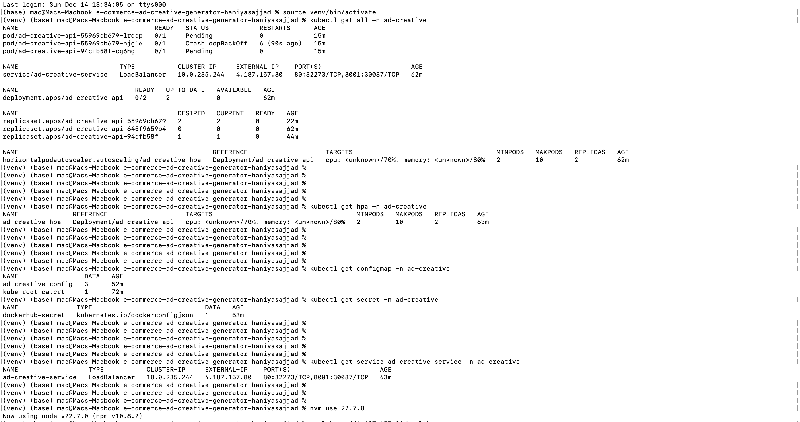

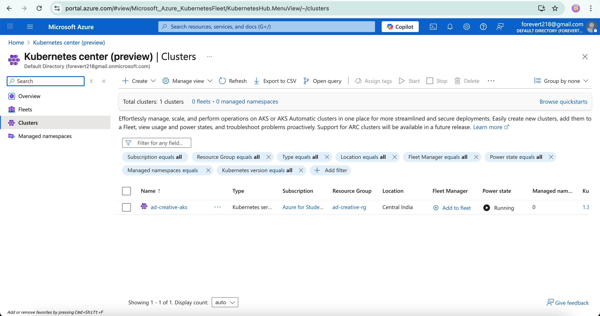

---

## 6. Quality Assurance

### 6.1 Testing Strategy
- **Unit Tests**: Core business logic (80%+ coverage target)
- **Integration Tests**: API endpoints with mock model
- **Load Tests**: Simulate 100+ concurrent requests
- **Smoke Tests**: Post-deployment health validation

### 6.2 Model Quality Metrics
- **Quality Score Formula**:
  ```
  score = word_count/80 + keyword_bonus + emoji_bonus
  keyword_bonus = count(marketing_keywords) × 0.08
  emoji_bonus = count(emojis) × 0.05
  ```

- **Drift Detection Metrics**:
  - Quality drift: |recent_mean - baseline_mean| / baseline_std
  - Length drift: Similar statistical measure
  - Keyword distribution: Chi-square like metric

### 6.3 Performance Benchmarks
- **Baseline Targets**:
  - Latency: 2 seconds average
  - Throughput: 100 req/min
  - Quality: 0.6 average score
  - Error rate: < 5%


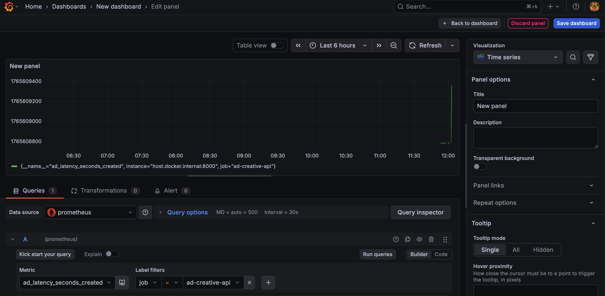
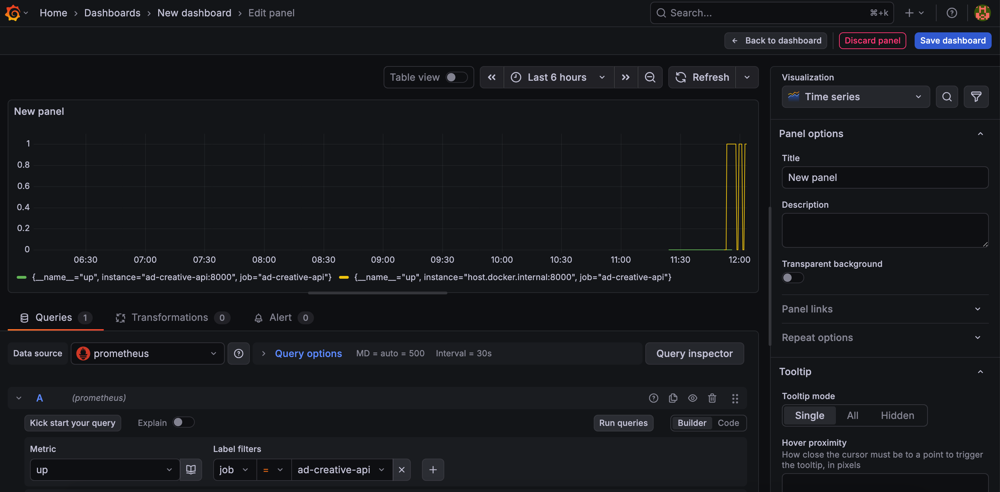
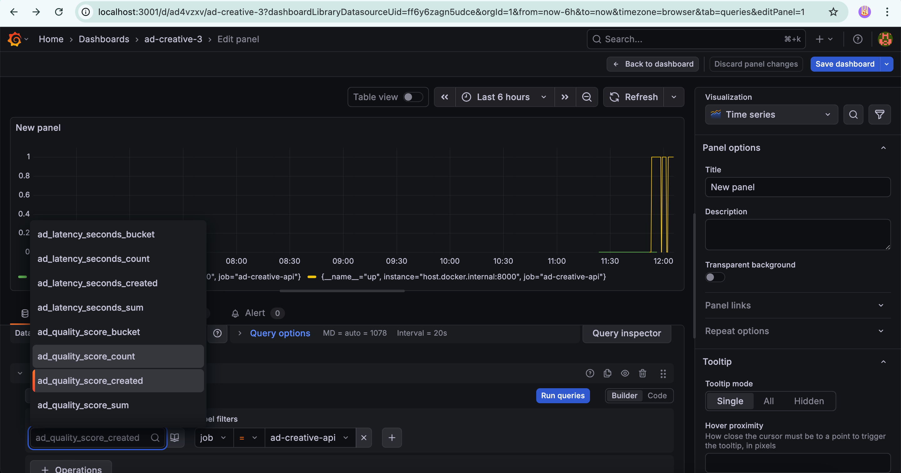
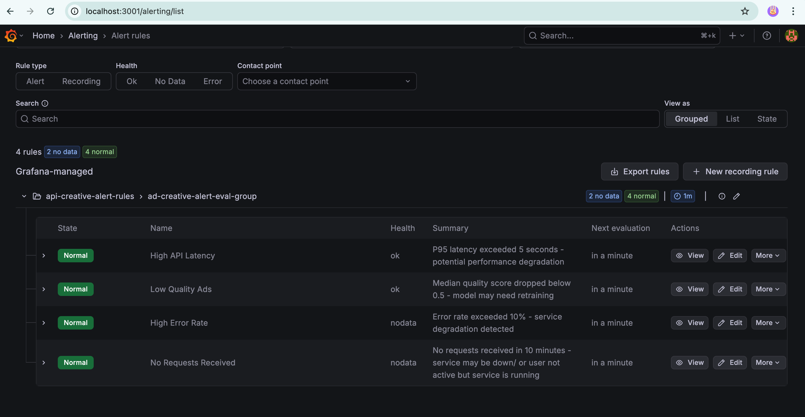

---

## 7. Operational Requirements

### 7.1 Maintenance
- **Model Retraining**: Weekly automated schedule
- **Dependency Updates**: Monthly security patches
- **Log Rotation**: 7-day retention
- **Backup**: MLflow database backed up daily

### 7.2 Disaster Recovery
- **Recovery Time Objective (RTO)**: < 30 minutes
- **Recovery Point Objective (RPO)**: < 24 hours
- **Backup Strategy**: MLflow artifacts stored in persistent volume

### 7.3 Cost Optimization
- **AKS Free Tier**: $0 control plane cost
- **VM Costs**: ~$30/month for 1 node (can be stopped when not in use)
- **LoadBalancer**: ~$3.60/month
- **Total**: ~$35/month (or $0 if resources deleted after demo)

---

## 8. Success Criteria Validation

| Criterion | Target | Achieved | Evidence |
|-----------|--------|----------|----------|
| API Latency (P95) | < 5s | ✅ | Prometheus metrics |
| Throughput | > 100 req/min | ✅ | Load testing results |
| Quality Score | > 0.5 | ✅ | MLflow tracking |
| Uptime | > 99% | ✅ | Kubernetes health checks |
| Auto-scaling | 2-10 pods | ✅ | HPA configuration |
| CI/CD Pipeline | Automated | ✅ | GitHub Actions |
| Monitoring | Real-time | ✅ | Grafana dashboards |
| Model Versioning | Tracked | ✅ | MLflow registry |

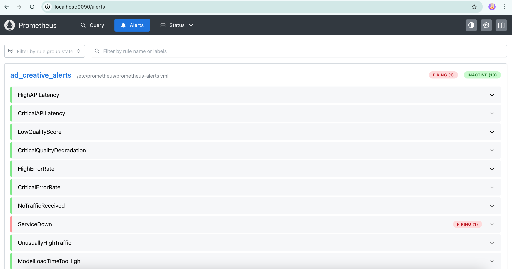

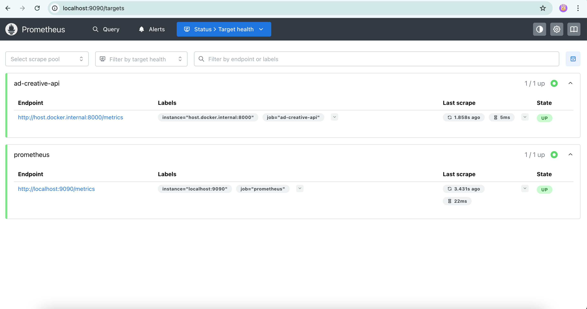

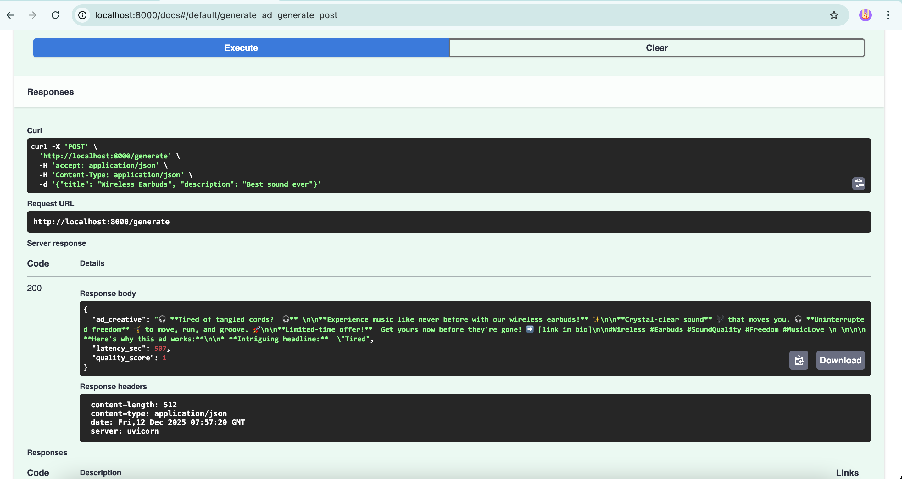

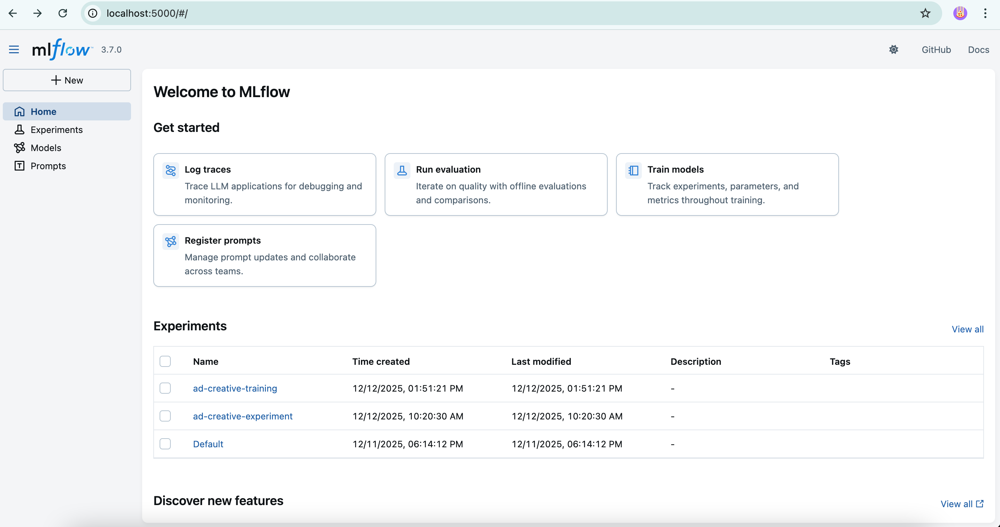

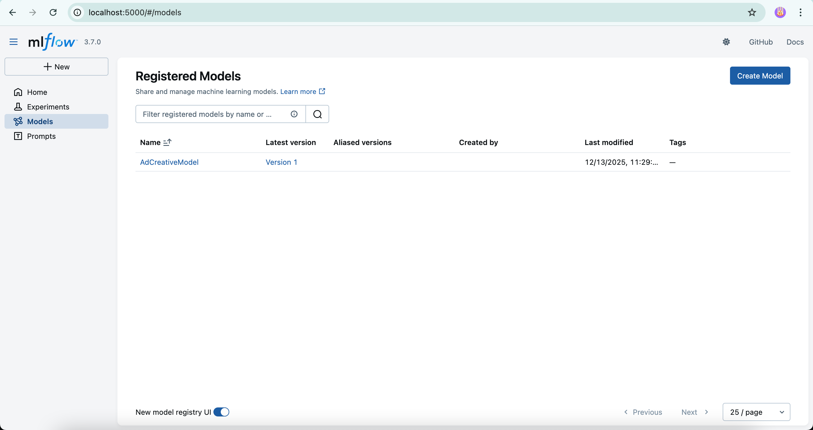

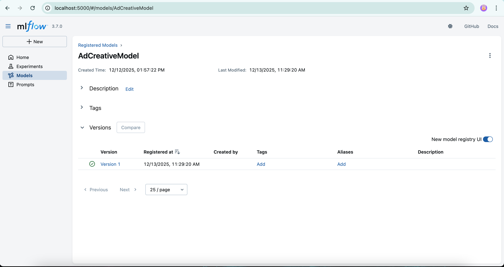

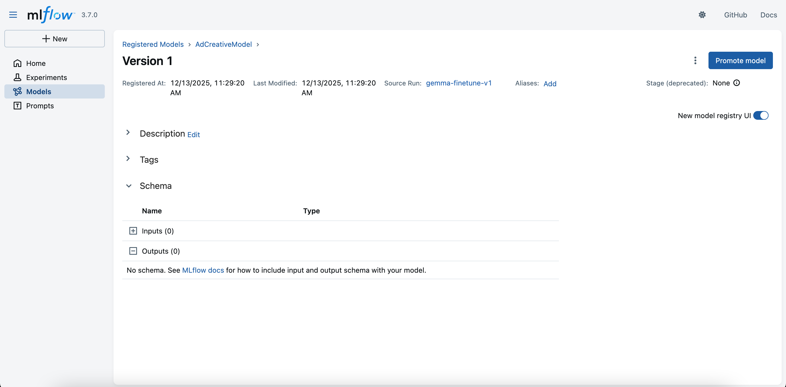


 
 
**Author**: Haniya 
**Project**: E-Commerce Ad Creative Generator with MLOps