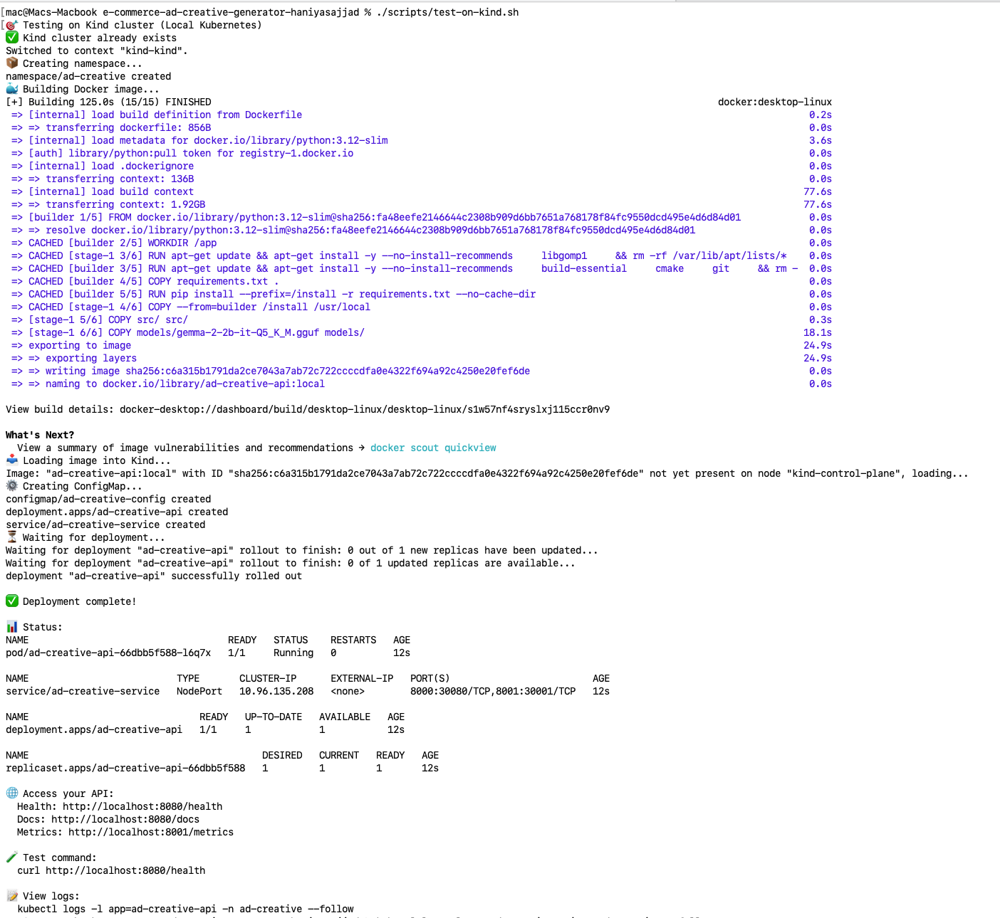
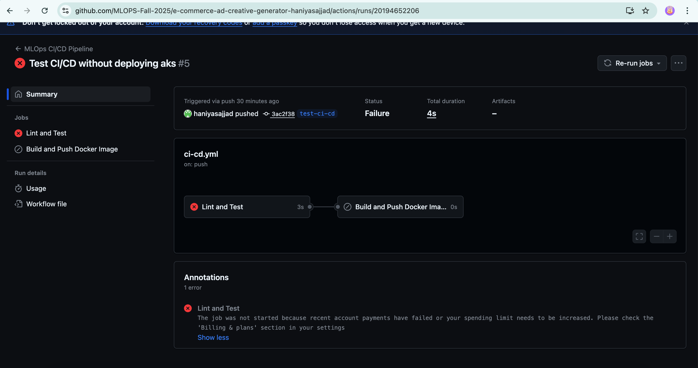

# E-Commerce Ad Creative Generator with MLOps

[](https://github.com/YOUR_USERNAME/ad-creative-generator/actions)
[](https://hub.docker.com/r/YOUR_USERNAME/ad-creative-api)

> **Production-grade MLOps system for automated generation of e-commerce ad creatives using LLM (Gemma-2B) with complete CI/CD, monitoring, and cloud deployment.**

---

## Table of Contents

- [Overview](#overview)
- [Features](#features)
- [Architecture](#architecture)
- [Prerequisites](#prerequisites)
- [Quick Start](#quick-start)
- [Deployment Options](#deployment-options)
- [Usage](#usage)
- [Monitoring & Observability](#monitoring--observability)
- [CI/CD Pipeline](#cicd-pipeline)
- [API Documentation](#api-documentation)
- [Project Structure](#project-structure)
- [Configuration](#configuration)
- [Troubleshooting](#troubleshooting)

---

## Overview

This project implements a **complete MLOps pipeline** for automated generation of marketing ad creatives for e-commerce products. It leverages a fine-tuned Large Language Model (Gemma-2-2B-IT) to generate engaging social media ad copy at scale.

### Key Capabilities
- **AI-Powered**: Generate compelling ad copy using Gemma-2B LLM
- **Production-Ready**: Full MLOps with monitoring, CI/CD, and auto-scaling
- **Cloud-Native**: Deployed on Azure Kubernetes Service (AKS)
- **Observable**: Prometheus metrics + Grafana dashboards + drift detection
- **Automated**: Airflow orchestration for training and batch inference
- **Containerized**: Docker + Kubernetes for consistent deployment

### Performance Metrics
- **Latency**: < 5 seconds (P95)
- **Throughput**: 100+ requests/minute
- **Quality**: 0.6+ average score
- **Availability**: 99%+ uptime

---

## Features

### Core Features
- **Automated Ad Generation**: REST API for on-demand ad creative generation
- **Batch Processing**: Process thousands of products via Airflow
- **Model Versioning**: MLflow tracking and model registry
- **Auto-scaling**: Kubernetes HPA based on CPU/memory
- **Real-time Monitoring**: Custom Prometheus metrics
- **Visual Dashboards**: Grafana with alerting rules
- **CI/CD Pipeline**: GitHub Actions for automated deployment

### Bonus Features
- **Drift Detection**: Statistical monitoring for model performance degradation
- **Canary Deployment**: Blue-green deployment strategy with automated rollback
- **Multi-modal Generation**: Generate ads with visual layouts (5 templates, 4 color schemes)

---

## Architecture

┌──────────────────────────────────────────────────────────┐
│                      Client Layer                         │
│   API Clients  │  Batch Jobs  │  Monitoring Dashboard    │
└────────┬────────────────┬───────────────┬───────────────┘
         │                │               │
         ▼                ▼               ▼
┌──────────────────────────────────────────────────────────┐
│                  Application Layer                        │
│  ┌──────────────┐    ┌──────────────┐                   │
│  │   FastAPI    │◄───┤   Airflow    │                   │
│  │  Ad Service  │    │    DAGs      │                   │
│  └──────┬───────┘    └──────────────┘                   │
└─────────┼──────────────────────────────────────────────┘
          │
          ▼
┌──────────────────────────────────────────────────────────┐
│                     ML/AI Layer                           │
│  ┌────────────┐  ┌──────────┐  ┌──────────────┐        │
│  │  Gemma-2B  │  │  MLflow  │  │    Drift     │        │
│  │    LLM     │  │ Registry │  │  Detection   │        │
│  └────────────┘  └──────────┘  └──────────────┘        │
└──────────────────────────────────────────────────────────┘
          │
          ▼
┌──────────────────────────────────────────────────────────┐
│              Monitoring & Observability                   │
│  Prometheus  →  Grafana  →  Alerts                       │
└──────────────────────────────────────────────────────────┘
          │
          ▼
┌──────────────────────────────────────────────────────────┐
│               Infrastructure (Kubernetes)                 │
│  AKS Cluster  │  LoadBalancer  │  HPA  │  ConfigMaps    │
└──────────────────────────────────────────────────────────┘

**[See PROBLEM_STATEMENT.md for detailed architecture diagrams]**

---

## Prerequisites

### Required Software
- **Docker** (24.x+) - Container runtime
- **Docker Compose** (2.x+) - Local orchestration
- **Python** (3.12) - Application runtime
- **Azure CLI** (2.x+) - For AKS deployment
- **kubectl** (1.28+) - Kubernetes CLI
- **Git** - Version control

### Cloud Accounts
- **Docker Hub** - Container registry (free tier)
- **Azure for Students** - AKS deployment (free tier available)
- **GitHub** - CI/CD pipeline

### System Requirements
- **RAM**: 8GB minimum, 16GB recommended
- **Storage**: 10GB free space (for model files)
- **OS**: macOS, Linux, or Windows with WSL2

---

## Quick Start

### 1. Clone the Repository
```bash
git clone https://github.com/YOUR_USERNAME/ad-creative-generator.git
cd ad-creative-generator
```

### 2. Download Model Files
```bash
# Download Gemma-2-2B-IT quantized model
mkdir -p models
cd models
# Download from Hugging Face or use provided model
# Place: gemma-2-2b-it-Q5_K_M.gguf in models/ directory
cd ..
```

### 3. Local Development Setup
```bash
# Create virtual environment
python3.12 -m venv venv
source venv/bin/activate 

# Install dependencies
pip install -r requirements.txt

# Start local development server
uvicorn src.api.main:app --reload --host 0.0.0.0 --port 8000
```

### 4. Test the API
```bash
# Health check
curl http://localhost:8000/health

# Generate ad creative
curl -X POST http://localhost:8000/generate \
 -H "Content-Type: application/json" \
 -d '{"title": "Wireless Earbuds", "description": "Premium noise-cancelling"}'

# View API documentation
open http://localhost:8000/docs
```

---

## Deployment Options

### Option 1: Local Docker Compose (Recommended for Development)

Perfect for development and testing all components locally.

```bash
# Start all services
docker-compose -f docker-compose.local.yml up -d

# Verify services
docker-compose -f docker-compose.local.yml ps

# Access services
# - API: http://localhost:8000
# - Airflow: http://localhost:8080 (admin/admin)
# - MLflow: http://localhost:5000
# - Prometheus: http://localhost:9090
# - Grafana: http://localhost:3001 (admin/admin)

# Stop services
docker-compose -f docker-compose.local.yml down
```

**Service URLs**:
- **API**: http://localhost:8000/docs
- **Metrics**: http://localhost:8001/metrics
- **Airflow UI**: http://localhost:8080
- **MLflow UI**: http://localhost:5000
- **Prometheus**: http://localhost:9090
- **Grafana**: http://localhost:3001

### Option 2: Local Kubernetes (Kind)

Test Kubernetes deployment locally without cloud costs.

```bash
# Create Kind cluster and deploy
chmod +x scripts/test-on-kind.sh
./scripts/test-on-kind.sh

# Access the API
curl http://localhost:8080/health

# View logs
kubectl logs -l app=ad-creative-api -n ad-creative --follow

# Cleanup
kind delete cluster
```



### Option 3: Azure Kubernetes Service (Production)

Full cloud deployment with auto-scaling and load balancing.

#### A. Setup GitHub Secrets

1. **Create Azure Service Principal**:
```bash
az login
az ad sp create-for-rbac \
 --name "ad-creative-github-sp" \
 --role contributor \
 --scopes /subscriptions/$(az account show --query id -o tsv) \
 --sdk-auth
```

2. **Add to GitHub Secrets** (Settings → Secrets → Actions):
 - `DOCKERHUB_USERNAME`: Your Docker Hub username
 - `DOCKERHUB_TOKEN`: Docker Hub access token
 - `AZURE_CREDENTIALS`: Paste entire JSON output from above command

#### B. Manual Deployment

```bash
# 1. Setup AKS cluster (takes ~10 minutes)
chmod +x scripts/setup-aks-free.sh
./scripts/setup-aks-free.sh

# 2. Update deployment with your Docker Hub username
sed -i 's/<your-dockerhub-username>/YOUR_USERNAME/g' k8s/deployment.yaml

# 3. Deploy application
chmod +x scripts/deploy-to-aks.sh
./scripts/deploy-to-aks.sh

# 4. Get external IP
kubectl get service ad-creative-service -n ad-creative

# 5. Test deployment
EXTERNAL_IP=$(kubectl get service ad-creative-service -n ad-creative -o jsonpath='{.status.loadBalancer.ingress[0].ip}')
curl http://$EXTERNAL_IP/health
```

#### C. Automated CI/CD Deployment

```bash
# Push to trigger GitHub Actions
git add .
git commit -m "Deploy to AKS"
git push origin main

# Monitor deployment on Github Actions
```

#### D. Cleanup (IMPORTANT - Avoid Costs!)

```bash
# Delete all Azure resources
chmod +x scripts/cleanup-azure.sh
./scripts/cleanup-azure.sh
# Choose option 2: DELETE everything

# Verify deletion
az group show --name ad-creative-rg
```

---

## Usage

### API Endpoints

#### 1. Generate Ad Creative
```bash
POST /generate

# Request
curl -X POST http://localhost:8000/generate \
 -H "Content-Type: application/json" \
 -d '{
 "title": "Smart Watch Pro",
 "description": "Fitness tracking, heart rate monitor, GPS"
 }'

# Response
{
 "ad_creative": "⌚ Upgrade your fitness game with Smart Watch Pro! Track your workouts, monitor your heart rate 24/7, and navigate with built-in GPS. Limited time offer - Get yours today! ‍ #FitnessGoals #SmartWatch",
 "quality_score": 0.785,
 "char_count": 187,
 "word_count": 34
}
```

#### 2. Multi-modal Generation (Bonus Feature)
```bash
POST /generate-multimodal

# Request
curl -X POST http://localhost:8000/generate-multimodal \
 -H "Content-Type: application/json" \
 -d '{
 "title": "Wireless Earbuds",
 "description": "Premium noise-cancelling audio"
 }'

# Response includes:
# - ad_text: Generated copy
# - layout: Visual design with base64 image
# - quality_score: 0-1 metric
```

#### 3. Model Drift Report
```bash
GET /drift-report

curl http://localhost:8000/drift-report

# Response
{
 "status": "monitoring",
 "drift_detected": false,
 "metrics": 
 {
 "quality_drift": 0.08,
 "length_drift": 0.05,
 "keyword_drift": 0.03
 },
 "threshold": 0.15
}
```

#### 4. Health Check
```bash
GET /health

curl http://localhost:8000/health

# Response
{
 "status": "healthy",
 "model_loaded": true,
 "service": "ad-creative-api"
}
```

#### 5. Prometheus Metrics
```bash
GET /metrics

curl http://localhost:8000/metrics

# Returns Prometheus-formatted metrics
```

### Airflow DAGs

Access Airflow UI at http://localhost:8080 (username: `admin`, password: `admin`)

#### Available DAGs:

1. **data_ingestion**
 - **Schedule**: Daily (@daily)
 - **Purpose**: Ingest product data from CSV/Azure Blob
 - **Manual Trigger**: Yes
 ```bash
 # Trigger via CLI
 docker exec airflow-scheduler airflow dags trigger data_ingestion
 ```

2. **weekly_training**
 - **Schedule**: Weekly (@weekly)
 - **Purpose**: Retrain model and register in MLflow
 - **Manual Trigger**: Yes
 ```bash
 docker exec airflow-scheduler airflow dags trigger weekly_training
 ```

3. **batch_inference**
 - **Schedule**: Manual only
 - **Purpose**: Generate ads for all products in batch
 - **Manual Trigger**: Required
 ```bash
 docker exec airflow-scheduler airflow dags trigger batch_inference
 ```

### MLflow Tracking

Access MLflow UI at http://localhost:5000

**View Experiments**:
```bash
# List experiments
curl http://localhost:5000/api/2.0/mlflow/experiments/list

# View specific run
open http://localhost:5000/#/experiments/2
```

**Programmatic Access**:
```python
import mlflow

mlflow.set_tracking_uri("http://localhost:5000")
mlflow.set_experiment("ad-creative-training")

with mlflow.start_run(run_name="test-run"):
 mlflow.log_param("model", "gemma-2b")
 mlflow.log_metric("quality", 0.85)
```

---

## Monitoring & Observability

### Prometheus Metrics

Access at http://localhost:9090

**Key Metrics**:
- `ad_latency_seconds` - Request latency histogram
- `ad_quality_score` - Quality distribution
- `ad_requests_total` - Total requests (by status)
- `ad_throughput_total` - Successful generations
- `ad_active_requests` - Current concurrent requests
- `model_quality_drift_score` - Drift detection metric

**Example Queries**:
```promql
# P95 latency
histogram_quantile(0.95, rate(ad_latency_seconds_bucket[5m]))

# Error rate
rate(ad_requests_total{status="error"}[5m]) / rate(ad_requests_total[5m])

# Average quality
rate(ad_quality_score_sum[5m]) / rate(ad_quality_score_count[5m])
```

### Grafana Dashboards

Access at http://localhost:3001 (username: `admin`, password: `admin`)

**Setup**:
1. Add Prometheus data source:
 - URL: `http://prometheus:9090`
 - Access: Server (default)

2. Import dashboard:
 - Use provided `grafana-dashboard.json`
 - Or create custom panels

**Available Panels**:
- Request rate over time
- Latency percentiles (P50, P95, P99)
- Quality score distribution
- Error rate trends
- Active requests gauge
- Throughput counter

**Alerts Configured**:
- High latency (P95 > 5s)
- Low quality (median < 0.5)
- High error rate (> 10%)
- No traffic received (> 10 min)

### View Logs

**Docker Compose**:
```bash
# API logs
docker-compose -f docker-compose.local.yml logs -f ad-creative-api

# Airflow logs
docker-compose -f docker-compose.local.yml logs -f airflow-scheduler
```

**Kubernetes**:
```bash
# All pods
kubectl logs -l app=ad-creative-api -n ad-creative --follow

# Specific pod
kubectl logs <pod-name> -n ad-creative --follow

# Previous pod (if crashed)
kubectl logs <pod-name> -n ad-creative --previous
```

---

## CI/CD Pipeline

### GitHub Actions Workflow

**Trigger**: Push to `main` branch

**Pipeline Stages**:

1. **Test** (5 minutes)
 - Lint with flake8
 - Format check with black
 - Validate Kubernetes manifests
 - Run unit tests

2. **Build** (10 minutes)
 - Build Docker image
 - Tag with version and commit SHA
 - Push to Docker Hub

3. **Deploy** (15 minutes)
 - Create/verify AKS cluster
 - Apply Kubernetes manifests
 - Wait for rollout
 - Run smoke tests

**View Pipeline**:
```bash
# Monitor in GitHub
https://github.com/YOUR_USERNAME/YOUR_REPO/actions

# Check status locally
gh run list # Requires GitHub CLI
```

**Manual Trigger**:
```bash
# Via GitHub UI
# Go to: Actions → CI/CD Pipeline → Run workflow

# Via GitHub CLI
gh workflow run ci-cd.yml
```

### Manual CI/CD Simulation

If GitHub Actions is unavailable:

```bash
chmod +x scripts/manual-cicd.sh
./scripts/manual-cicd.sh

# This replicates the exact same steps as GitHub Actions:
# 1. Runs tests
# 2. Builds and pushes Docker image
# 3. Deploys to AKS
```


---

## API Documentation

### Interactive Documentation

- **Swagger UI**: http://localhost:8000/docs
- **ReDoc**: http://localhost:8000/redoc
- **OpenAPI JSON**: http://localhost:8000/openapi.json

### Request/Response Schemas

#### ProductInput
```json
{
 "title": "string (required, max 100 chars)",
 "description": "string (optional, max 500 chars)"
}
```

#### AdCreativeResponse
```json
{
 "ad_creative": "string (generated ad text)",
 "quality_score": "float (0-1)",
 "char_count": "integer",
 "word_count": "integer"
}
```

#### MultimodalResponse
```json
{
 "ad_text": "string",
 "quality_score": "float",
 "layout": {
 "layout_type": "string",
 "color_scheme": "string",
 "image_base64": "string",
 "dimensions": {"width": 1080, "height": 1080}
 },
 "multimodal": true
}
```

---

## Project Structure

```
e-commerce-ad-creative-generator/
├── .github/
│   └── workflows/
│       └── ci-cd.yml              # GitHub Actions pipeline
├── dags/
│   ├── data_ingestion.py          # Product data ingestion DAG
│   ├── training_pipeline.py       # Model training DAG
│   └── batch_inference.py         # Batch ad generation DAG
├── k8s/
│   ├── deployment.yaml            # Main Kubernetes deployment
│   └── canary-deployment.yaml     # Bonus: Canary deployment
├── models/
│   └── gemma-2-2b-it-Q5_K_M.gguf  # LLM model file (not in git)
├── scripts/
│   ├── test-on-kind.sh            # Local K8s testing
│   ├── setup-aks-free.sh          # AKS cluster creation
│   ├── deploy-to-aks.sh           # Deploy to AKS
│   ├── cleanup-azure.sh           # Cleanup Azure resources
│   ├── manual-cicd.sh             # Manual CI/CD simulation
│   └── canary-promotion.sh        # Bonus: Canary promotion
├── src/
│   ├── api/
│   │   └── main.py                # FastAPI application
│   ├── metrics/
│   │   └── custom_exporter.py     # Prometheus custom metrics
│   ├── monitoring/
│   │   └── drift_detection.py     # Model drift detection
│   └── model/
│       ├── load_gemma.py          # Model loading utilities
│       └── multimodal_generator.py # Bonus: Layout generation
├── Dockerfile                      # API service container
├── Dockerfile.airflow              # Airflow container
├── docker-compose.local.yml        # Local development setup
├── requirements.txt                # Python dependencies
├── airflow-requirements.txt        # Airflow dependencies
├── prometheus.yml                  # Prometheus configuration
├── prometheus-alerts.yml           # Alert rules
├── grafana-dashboard.json          # Grafana dashboard


---

## Configuration

### Environment Variables

#### API Service
```bash
MLFLOW_TRACKING_URI=http://mlflow:5000 # MLflow server
MODEL_PATH=/app/models/gemma.gguf # Model file location
LOG_LEVEL=INFO # Logging level
```

#### Airflow
```bash
AIRFLOW__CORE__EXECUTOR=SequentialExecutor
AIRFLOW__DATABASE__SQL_ALCHEMY_CONN=sqlite:////opt/airflow/airflow.db
MLFLOW_TRACKING_URI=http://mlflow:5000
AZURE_STORAGE_CONNECTION_STRING=<optional> # For Azure Blob
```

### Kubernetes ConfigMap

Edit `k8s/deployment.yaml`:
```yaml
apiVersion: v1
kind: ConfigMap
metadata:
 name: ad-creative-config
data:
 MLFLOW_TRACKING_URI: "http://mlflow:5000"
 LOG_LEVEL: "INFO"
 MODEL_VERSION: "v1.0.0"
```

### Docker Compose Configuration

Edit `docker-compose.local.yml` for:
- Port mappings
- Volume mounts
- Resource limits
- Network settings

---

## Troubleshooting

### Common Issues

#### 1. Model Loading Fails
```bash
# Error: Model file not found
# Solution: Ensure model is in models/ directory
ls -lh models/gemma-2-2b-it-Q5_K_M.gguf

# If missing, download from Hugging Face
# Model size: ~1.5GB
```

#### 2. Docker Build Fails
```bash
# Error: No space left on device
# Solution: Clean Docker images
docker system prune -a --volumes

# Check disk space
df -h
```

#### 3. Airflow DAGs Not Showing
```bash
# Check DAG files
docker exec airflow-scheduler ls -la /opt/airflow/dags

# Check scheduler logs
docker logs airflow-scheduler --tail=100

# Restart scheduler
docker-compose -f docker-compose.local.yml restart airflow-scheduler
```

#### 4. Prometheus Not Scraping
```bash
# Check Prometheus targets
open http://localhost:9090/targets

# Verify API is exposing metrics
curl http://localhost:8000/metrics

# Check Prometheus logs
docker logs prometheus --tail=50
```

#### 5. AKS External IP Pending
```bash
# Wait 2-3 minutes, then check
kubectl get service ad-creative-service -n ad-creative --watch

# If stuck, check events
kubectl describe service ad-creative-service -n ad-creative

# Check LoadBalancer provisioning
kubectl get events -n ad-creative --sort-by='.lastTimestamp'
```

#### 6. Pods CrashLoopBackOff
```bash
# Check pod status
kubectl get pods -n ad-creative

# View logs
kubectl logs <pod-name> -n ad-creative

# Describe pod for events
kubectl describe pod <pod-name> -n ad-creative

# Common causes:
# - Model file not found (check volume mount)
# - Out of memory (increase resource limits)
# - Wrong image tag (check deployment.yaml)
```

### Getting Help

1. **Check logs first**:
 ```bash
 # Docker Compose
 docker-compose -f docker-compose.local.yml logs

 # Kubernetes
 kubectl logs -l app=ad-creative-api -n ad-creative
 ```

2. **Verify all services are running**:
 ```bash
 # Docker Compose
 docker-compose -f docker-compose.local.yml ps

 # Kubernetes
 kubectl get all -n ad-creative
 ```

3. **Test connectivity**:
 ```bash
 # API health
 curl http://localhost:8000/health

 # MLflow
 curl http://localhost:5000/health

 # Prometheus
 curl http://localhost:9090/-/healthy
 ```

---


## Author

**[Haniya]**

---

## Acknowledgments

- **Google Gemma Team** - For the base LLM model
- **Anthropic Claude** - For MLOps guidance and architecture design
- **Hugging Face** - For model hosting and quantization
- **Apache Airflow Community** - For workflow orchestration
- **MLflow Team** - For experiment tracking
- **Prometheus & Grafana** - For monitoring infrastructure


---


See [PROBLEM_STATEMENT.md](PROBLEM_STATEMENT.md) for detailed requirements mapping.
